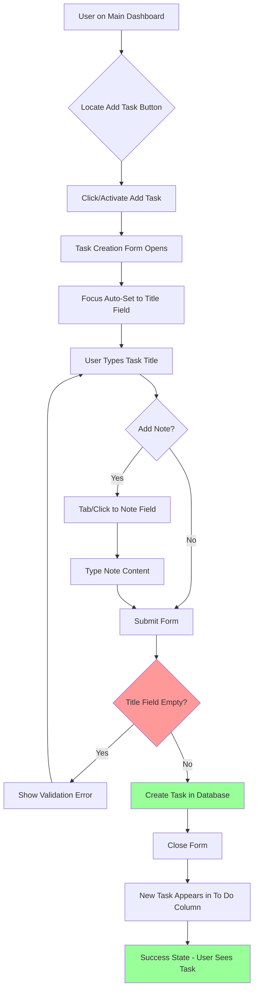
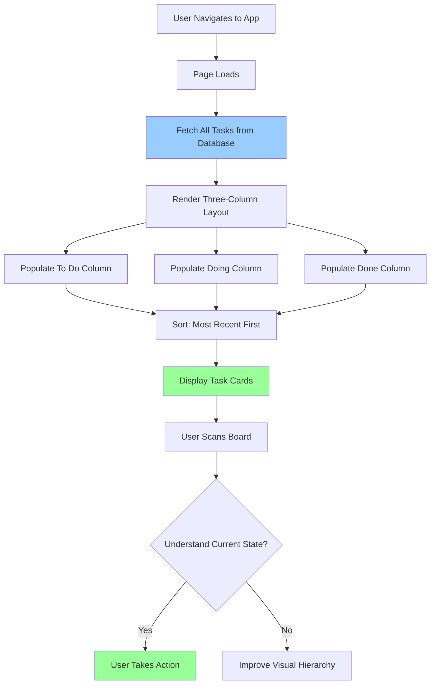
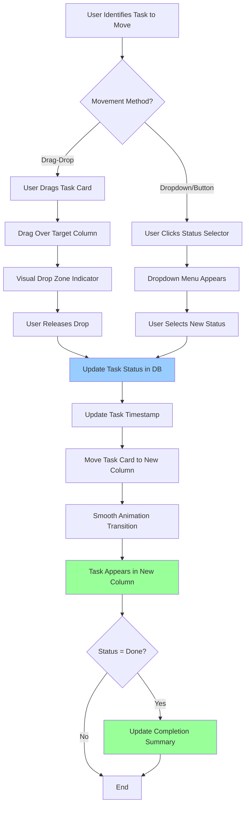
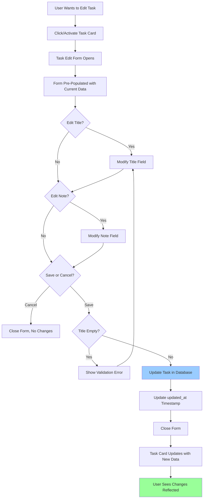
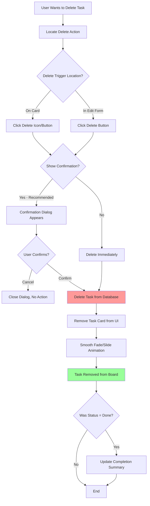
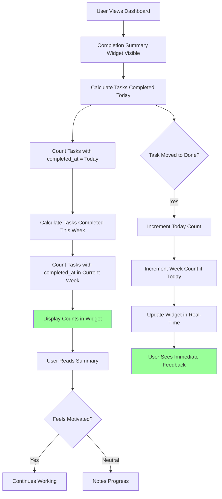
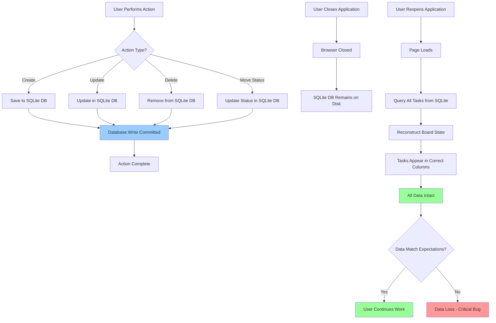

# Personal TaskBoard UX/UI Specification

_Generated on 2025-10-21 by Kevin_

## Executive Summary

Personal TaskBoard is a lightweight, personal task management application designed for knowledge workers who need to track informal, ad-hoc commitments that fall outside structured enterprise project management systems. The application addresses the common problem of tasks getting lost in Slack threads, emails, and verbal conversations.

**Core Value Proposition:** Provide a simple, visual workflow (To Do → Doing → Done) for personal accountability and mental clarity, optimized for quick task capture and satisfaction from visible progress.

**Key Characteristics:**
- **Single-page application** with three-column task board interface
- **Local-only deployment** (no authentication, no cloud sync)
- **Fast task capture** (<5 seconds from intent to board)
- **Professional aesthetic** suitable for business environments
- **7 primary user journeys** captured in PRD (US1-US7)
- **10 functional requirements** spanning CRUD operations, task movement, persistence, and completion tracking

**Technical Context:**
- Stack: Next.js + React + TypeScript + SQLite
- Architecture: Monolithic Next.js application (monorepo)
- Target: Desktop browsers (1280px+ viewport minimum)
- Quality bars: >70% unit test coverage, 100% E2E coverage of user stories

**UX Scope for This Specification:**
- Information architecture for single-page task board
- User flows for all 7 user stories
- Component design for task cards, columns, creation/editing interfaces
- Visual design foundation (color, typography, spacing)
- Responsive strategy for desktop viewports
- Accessibility requirements (keyboard navigation, focus states)

---

## 1. UX Goals and Principles

### 1.1 Target User Personas

**Primary Persona: "Taylor - The Busy Knowledge Worker"**

**Demographics:**
- Role: Individual contributor or manager in a professional environment
- Work style: High volume of asynchronous communication (Slack, email, meetings)
- Tech savvy: Comfortable with web applications and productivity tools

**Goals:**
- Track informal commitments that don't belong in Jira/Asana
- Maintain personal accountability without overhead
- Achieve mental clarity by externalizing task memory
- Feel a sense of progress through visible task completion

**Pain Points:**
- Tasks lost in Slack threads and email
- Verbal commitments forgotten
- Overhead of enterprise project management tools for small tasks
- Mental burden of remembering ad-hoc requests
- Lack of visibility into personal progress on informal work

**Context of Use:**
- Throughout workday when receiving informal requests
- Daily review to prioritize and track progress
- Works primarily from desktop computer (1280px+ screen)
- Needs quick capture without context switching

**Success Criteria:**
- Can add task in <5 seconds
- Board state clear at a glance
- Zero tasks lost due to app issues
- Feels satisfaction from moving tasks to "Done"

### 1.2 Usability Goals

**Speed:**
- Task creation: <5 seconds from intent to board
- Page load time: <300ms (per NFR2)
- Instant feedback for all user actions
- No loading spinners for local operations

**Clarity:**
- Understand board state at a glance
- Immediately see what's in progress vs. completed
- Clear visual hierarchy (what's most important)
- Uncluttered interface with focused information

**Reliability:**
- Zero data loss across application restarts (per FR7)
- All changes persist immediately to database
- Predictable behavior for all operations

**Ease of Learning:**
- Intuitive three-column metaphor (To Do → Doing → Done)
- Discoverable actions (clear affordances)
- No manual or training required
- Familiar interaction patterns

**Professional Feel:**
- Suitable for business environment
- Credible and trustworthy design
- Neutral, focused aesthetic
- Not playful or consumer-oriented

**Accessibility:**
- Basic keyboard navigation support (per Section 3.4)
- Visible focus states
- Supports standard browser zoom
- Screen reader compatible (future enhancement)

### 1.3 Design Principles

**1. Speed Over Features**
- Optimize for the 80% use case: quick capture and status updates
- Minimize clicks and keystrokes for primary actions
- Prefer inline interactions over modals when possible
- Fast is better than fancy

**2. Clarity Through Simplicity**
- Show only what's necessary
- Use visual hierarchy to guide attention
- Avoid cognitive overhead (no complex features)
- Empty states should guide users to first action

**3. Direct Manipulation**
- Users should interact directly with tasks (not through layers of UI)
- Immediate visual feedback for all actions
- Avoid confirmation dialogs for non-destructive actions
- Make status changes feel physical and satisfying

**4. Personal and Local**
- No accounts, no login, no sync complexity
- Data lives locally and loads instantly
- Privacy by default (nothing leaves the machine)
- User owns their data completely

**5. Professional Minimalism**
- Clean, uncluttered interface
- Neutral color palette with purposeful accents
- Typography that's readable and professional
- Visual polish without distraction

---

## 2. Information Architecture

### 2.1 Site Map

**Application Structure: Single-Page Application (SPA)**

```
Personal TaskBoard (/)
├── Header Section
│   ├── App Title/Logo
│   └── Completion Summary Widget
│       ├── Tasks Completed Today
│       └── Tasks Completed This Week
│
├── Main Board Section
│   ├── Column: To Do
│   │   ├── Column Header
│   │   ├── Add Task Button (primary)
│   │   └── Task Cards (list)
│   │
│   ├── Column: Doing
│   │   ├── Column Header
│   │   └── Task Cards (list)
│   │
│   └── Column: Done
│       ├── Column Header
│       └── Task Cards (list)
│
└── Modals/Overlays (as needed)
    ├── Task Creation Form
    ├── Task Edit Form
    └── Delete Confirmation (optional)
```

**Screen Inventory:**
- **Primary View**: Main Dashboard (task board)
- **Overlays**: Task creation/edit interface (modal or slide-out)

**No Multi-Page Navigation:**
- Single URL route (/)
- No authentication pages
- No settings pages (out of scope for MVP)
- No separate task detail pages
- All interactions happen on main board

### 2.2 Navigation Structure

**Primary Navigation: None Required**
- Single-page application with no page-level navigation
- All functionality accessible from main board view

**Intra-Page Navigation:**
- Visual scanning across three columns (left to right: To Do → Doing → Done)
- Focus management for keyboard users (Tab order: Summary → Add Task → Task Cards)
- Scroll within columns if task count exceeds viewport height

**Interaction Navigation:**
- **Add Task**: Trigger from "Add Task" button (located in To Do column header)
- **Edit Task**: Click/activate task card to edit inline or open edit form
- **Move Task**: Drag-drop or dropdown/button UI (architect decision per PRD 6.1)
- **Delete Task**: Action available within task card or edit interface

**Keyboard Navigation Flow:**
1. Tab to Summary widget (optional stop)
2. Tab to "Add Task" button
3. Tab into To Do column → through each task
4. Tab into Doing column → through each task
5. Tab into Done column → through each task
6. Shift+Tab reverses direction

**Mobile Navigation (Future):**
- Out of scope for MVP (desktop only per PRD Section 3.6)
- Future: Horizontal scroll or vertical stack of columns

---

## 3. User Flows

### 3.1 User Flow: Quick Task Capture (US1)

**User Goal:** Quickly create a task with title and optional note

**Entry Points:**
- User lands on main dashboard
- User receives informal request and wants to capture it

**Flow Diagram:**



**Step-by-Step Flow:**
1. User clicks "Add Task" button in To Do column header
2. Task creation form appears (modal or inline)
3. Focus automatically set to title input field
4. User types task title (required)
5. User optionally tabs to note field and adds details
6. User submits form (Enter key or Save button)
7. **Validation**: Title required - show error if empty
8. Task created and saved to database
9. Form closes, new task appears at top of To Do column
10. User sees immediate confirmation (task visible on board)

**Success Criteria:**
- Time from click to task visible: <5 seconds
- Title field auto-focused (no extra click)
- Enter key submits form (keyboard efficiency)
- Task appears immediately (no loading state)

**Error States:**
- Empty title: Show inline error, keep form open, maintain note content
- Database error: Show error message, allow retry

**Edge Cases:**
- Very long title (>200 chars): Truncate display, show full on hover/edit
- Very long note: Truncate display, show full on edit
- Multiple rapid task creation: Queue submissions, prevent duplicates

---

### 3.2 User Flow: Visual Workflow Organization (US2)

**User Goal:** See tasks organized in three columns at a glance

**Entry Points:**
- User opens/refreshes application
- User returns to application after closing

**Flow Diagram:**



**Step-by-Step Flow:**
1. User navigates to application URL
2. Page loads with skeleton/loading state (< 300ms)
3. Application fetches all tasks from SQLite database
4. Three-column layout renders (To Do | Doing | Done)
5. Tasks populate into respective columns based on status
6. Within each column, tasks sorted with most recent first
7. Task cards display with title, note preview, timestamp
8. User visually scans board left to right
9. User immediately understands current workload and progress

**Success Criteria:**
- Load time < 300ms (NFR2)
- Clear visual separation between columns
- Column headers clearly labeled
- Task count visible per column
- Most recent tasks at top (no manual sorting needed)

**Display Rules:**
- **To Do**: Tasks with status = 'todo', sorted by created_at DESC
- **Doing**: Tasks with status = 'doing', sorted by updated_at DESC
- **Done**: Tasks with status = 'done', sorted by completed_at DESC

---

### 3.3 User Flow: Task Progression (US3)

**User Goal:** Move tasks between status columns to track progress

**Entry Points:**
- User starts work on a To Do task
- User completes a Doing task
- User needs to move a Done task back to Doing (re-open)

**Flow Diagram:**



**Step-by-Step Flow (Drag-Drop):**
1. User hovers over task card (cursor becomes grab icon)
2. User clicks and holds to start drag
3. Task card lifts visually (shadow/elevation)
4. User drags over target column
5. Target column shows drop zone indicator (highlight/border)
6. User releases mouse to drop
7. Task status updated in database
8. Task timestamp updated (updated_at or completed_at)
9. Task animates to new position in target column
10. If moved to Done: Completion summary increments

**Step-by-Step Flow (Dropdown/Button):**
1. User clicks on task card status indicator/dropdown
2. Dropdown menu appears with three options (To Do | Doing | Done)
3. Current status shown as selected/checked
4. User clicks desired new status
5. Task status updated in database
6. Task timestamp updated
7. Task moves to new column (animated)
8. If moved to Done: Completion summary increments

**Success Criteria:**
- Status change feels immediate (< 100ms perceived)
- Visual feedback during interaction
- Task appears in correct column sorted appropriately
- Completion summary updates in real-time
- No loading spinners (local database)

**Error States:**
- Database update fails: Task snaps back to original column, show error toast
- Concurrent update conflict: Refresh board state

---

### 3.4 User Flow: Task Detail Management (US4)

**User Goal:** Edit task title and note after creation

**Entry Points:**
- User clicks on task card to edit
- User realizes task details need updating

**Flow Diagram:**



**Step-by-Step Flow:**
1. User clicks on task card (or clicks "Edit" button on card)
2. Edit form opens (same UI as create, different context)
3. Title and note fields pre-populated with current values
4. User modifies title and/or note
5. User clicks Save or presses Enter
6. **Validation**: Title cannot be empty
7. Task updated in database
8. updated_at timestamp set to current time
9. Form closes
10. Task card updates in place to show new title/note
11. Task remains in same column (status unchanged)

**Success Criteria:**
- Edit form visually identical to create form (consistency)
- Current data pre-filled (no re-typing)
- Save preserves task status and column position
- updated_at timestamp updated for edit history
- Changes appear immediately

**Alternative Interaction: Inline Editing**
- User double-clicks task title → becomes editable in place
- User edits directly on card, clicks outside or presses Enter to save
- Faster for simple title changes
- Open design decision (architect choice per PRD 6.1)

---

### 3.5 User Flow: Task Removal (US5)

**User Goal:** Delete tasks that are no longer relevant

**Entry Points:**
- User realizes task was created by mistake
- Task no longer relevant or duplicate

**Flow Diagram:**



**Step-by-Step Flow:**
1. User locates Delete button/icon on task card or in edit form
2. User clicks Delete
3. **Optional**: Confirmation dialog appears ("Delete this task?")
4. User confirms deletion
5. Task deleted from database (hard delete for MVP)
6. Task card animates out (fade + slide)
7. Task removed from board
8. If task was in Done: Completion summary decrements
9. Gap in column closes smoothly

**Success Criteria:**
- Delete action clearly visible but not easily triggered by accident
- Optional confirmation prevents accidental deletion
- Deletion feels immediate (no loading state)
- Smooth animation (not jarring)
- Task does not reappear on app restart

**Design Considerations:**
- **Confirmation**: Recommended for destructive action
- **Undo**: Out of scope for MVP, but consider future
- **Archive vs. Delete**: MVP uses hard delete; archive is future enhancement
- **Delete from any column**: Users can delete from To Do, Doing, or Done

---

### 3.6 User Flow: Progress Visibility (US6)

**User Goal:** See summary of completed tasks for motivation

**Entry Points:**
- User glances at dashboard
- User completes a task and wants to see progress
- User starts workday and reviews yesterday's accomplishments

**Flow Diagram:**



**Step-by-Step Flow:**
1. Completion summary widget always visible in header/banner area
2. On page load, calculate completed tasks:
   - **Today**: Count of tasks where completed_at date = current date
   - **This Week**: Count of tasks where completed_at date in current week (Monday-Sunday)
3. Display counts prominently: "Completed Today: 5 | This Week: 23"
4. When user moves task to Done:
   - Set completed_at timestamp to current time
   - Increment Today count by 1
   - Increment Week count by 1
   - Update widget immediately (no page refresh)
5. User sees count increase, providing immediate positive feedback

**Success Criteria:**
- Summary visible at all times (no scrolling needed)
- Counts update in real-time (no refresh required)
- Clear labeling ("Today" vs "This Week")
- Visual prominence (not buried in UI)
- Accurate calculation (time zone aware)

**Calculation Logic:**
- **Today**: Tasks where DATE(completed_at) = DATE(NOW())
- **This Week**: Tasks where completed_at >= START_OF_WEEK AND completed_at <= END_OF_WEEK
- Week definition: Monday (start) to Sunday (end), or configurable
- Time zone: Use local browser time

**Display Format:**
```
✓ Completed Today: 5  |  This Week: 23
```

---

### 3.7 User Flow: Persistent Personal Workspace (US7)

**User Goal:** All tasks persist across application restarts

**Entry Points:**
- User closes browser/tab
- User refreshes page
- User returns next day

**Flow Diagram:**



**Step-by-Step Flow (Data Persistence):**
1. User performs any action (create, edit, move, delete)
2. Action immediately written to SQLite database
3. Database transaction committed before UI confirmation
4. User sees feedback only after database write succeeds

**Step-by-Step Flow (Data Restoration):**
1. User reopens application (new browser session)
2. Application initializes and connects to SQLite database
3. Query: `SELECT * FROM tasks ORDER BY created_at DESC`
4. Tasks loaded and grouped by status
5. Board re-renders with all tasks in correct columns
6. Timestamps preserved exactly as originally set
7. User sees their workspace exactly as they left it

**Success Criteria:**
- Zero data loss across any restart scenario
- All task fields persist: title, note, status, timestamps
- Task order preserved (most recent first)
- No user action required for persistence (automatic)
- Database resilient to crashes (ACID properties)

**Technical Requirements:**
- SQLite database file persisted to disk
- Database writes synchronous (not buffered)
- Each user action = immediate database transaction
- No caching layer that could lose data
- Database schema includes all required fields:
  - id, title, note, status, created_at, updated_at, completed_at

**Error Handling:**
- Database write failure: Show error to user, allow retry
- Database file corruption: Recovery strategy (backup/restore)
- Database file missing: Initialize new database, inform user of data loss

---

## 4. Component Library and Design System

### 4.1 Design System Approach

**Recommendation: Hybrid Approach Using shadcn/ui + Tailwind CSS**

**Rationale:**
- **shadcn/ui**: Copy-paste component library (not NPM dependency)
  - Components owned by project (full customization)
  - Built on Radix UI primitives (accessibility built-in)
  - TypeScript-native with excellent DX
  - Tailwind CSS-based styling
  - No bloat (only install components you use)

- **Tailwind CSS**: Utility-first CSS framework
  - Rapid UI development
  - Consistent spacing/color system
  - Tree-shakeable (small bundle size)
  - Professional defaults
  - Excellent Next.js integration

**Design System Structure:**
```
/components
  /ui              # shadcn/ui base components
    - button.tsx
    - card.tsx
    - dialog.tsx
    - dropdown-menu.tsx
    - input.tsx
    - textarea.tsx
  /task-board      # Application-specific components
    - TaskBoard.tsx
    - TaskColumn.tsx
    - TaskCard.tsx
    - TaskForm.tsx
    - CompletionSummary.tsx
```

**Component Philosophy:**
- **Composable**: Build complex UIs from simple primitives
- **Reusable**: Design components for multiple contexts
- **Accessible**: Keyboard navigation, ARIA attributes, focus management
- **Typed**: Full TypeScript coverage with prop types
- **Testable**: Components accept props, minimal side effects

**Alternative Considered:**
- **Custom components only**: More control, but slower development
- **Material UI / Ant Design**: Feature-rich but heavier, less customizable
- **Headless UI**: Good alternative, but shadcn/ui offers better DX for this use case

### 4.2 Core Components

#### 4.2.1 TaskBoard (Container Component)

**Purpose:** Top-level container that manages board state and layout

**Key Responsibilities:**
- Fetch tasks from database on mount
- Manage global board state (if not using server state)
- Provide task CRUD operations to child components
- Layout three-column structure
- Handle drag-drop context (if drag-drop chosen)

**Props:**
```typescript
interface TaskBoardProps {
  initialTasks?: Task[]  // For SSR/prefetching
}
```

**Variants:** Single variant (full-width layout)

**States:**
- Loading: Skeleton or spinner during initial fetch
- Empty: No tasks in any column (show onboarding message)
- Populated: Normal state with tasks displayed
- Error: Database connection failed

---

#### 4.2.2 TaskColumn (Layout Component)

**Purpose:** Column container for tasks in a single status

**Key Responsibilities:**
- Display column header with status label
- Render list of TaskCard components
- Handle drop zone for drag-drop (if enabled)
- Show empty state when no tasks
- Provide "Add Task" button in To Do column

**Props:**
```typescript
interface TaskColumnProps {
  status: 'todo' | 'doing' | 'done'
  title: string
  tasks: Task[]
  onAddTask?: () => void        // For To Do column only
  onTaskMove?: (taskId: string, newStatus: string) => void
  onTaskEdit?: (taskId: string) => void
  onTaskDelete?: (taskId: string) => void
}
```

**Variants:**
- To Do: Includes "Add Task" button in header
- Doing: Standard column
- Done: Standard column (optionally grayed out visually)

**States:**
- Empty: Show friendly message ("No tasks yet" / "Nothing in progress" / "No completed tasks")
- Populated: Normal state
- Drop target (drag-drop): Highlighted border when task dragged over

---

#### 4.2.3 TaskCard (Content Component)

**Purpose:** Individual task display with interaction affordances

**Key Responsibilities:**
- Display task title (truncate if long)
- Display note preview (first line, truncated)
- Show relevant timestamp
- Provide edit and delete actions
- Support drag (if drag-drop enabled)
- Provide status change UI (dropdown or shown on hover)

**Props:**
```typescript
interface TaskCardProps {
  task: Task
  onEdit: (taskId: string) => void
  onDelete: (taskId: string) => void
  onStatusChange: (taskId: string, newStatus: string) => void
  draggable?: boolean
}
```

**Variants:**
- Default: Standard card appearance
- Hover: Show action buttons, subtle elevation
- Dragging: Elevated, slight transparency
- Focused: Keyboard focus state (thick border)

**States:**
- Default: Idle state
- Hover: Mouse over card (show actions)
- Active/Pressed: Mouse down (for drag or click)
- Focused: Keyboard focus (visible outline)
- Editing: Card in edit mode (if inline editing)

**Visual Structure:**
```
┌─────────────────────────────┐
│ [Title]               [···] │  ← Overflow menu (edit/delete)
│ [Note preview...]           │
│ [Timestamp]    [Status ▼]   │  ← Optional status dropdown
└─────────────────────────────┘
```

**Accessibility:**
- Role: article or button (depending on click behavior)
- Aria-label: Full task title if truncated
- Focusable: tabindex="0"
- Keyboard actions: Enter to edit, Delete key to delete (with confirmation)

---

#### 4.2.4 TaskForm (Form Component)

**Purpose:** Create and edit task details

**Key Responsibilities:**
- Display title input (required) and note textarea (optional)
- Validate title is not empty
- Submit to create or update task
- Handle cancel action
- Auto-focus title field on open
- Support keyboard shortcuts (Enter to submit, Esc to cancel)

**Props:**
```typescript
interface TaskFormProps {
  mode: 'create' | 'edit'
  task?: Task                    // For edit mode
  onSubmit: (data: TaskInput) => void
  onCancel: () => void
  isOpen: boolean
}

interface TaskInput {
  title: string
  note?: string
}
```

**Variants:**
- Create mode: Empty form, "Add Task" title
- Edit mode: Pre-filled form, "Edit Task" title

**States:**
- Default: Form visible, no errors
- Validation error: Title empty, show inline error message
- Submitting: Disabled inputs, loading indicator (if async)
- Success: Form closes, task appears on board

**Visual Structure (Modal):**
```
┌─────────────────────────────────┐
│  Add Task                    [×]│
├─────────────────────────────────┤
│  Title *                        │
│  [________________________]     │
│                                 │
│  Note (optional)                │
│  [________________________]     │
│  [________________________]     │
│  [________________________]     │
│                                 │
│        [Cancel]  [Add Task]     │
└─────────────────────────────────┘
```

**Validation:**
- Title required: Show error "Title is required" if empty on submit
- Max length: Title 200 chars, Note 2000 chars (soft limit)

**Keyboard Shortcuts:**
- Enter: Submit form (when in title field)
- Ctrl/Cmd + Enter: Submit form (when in note textarea)
- Escape: Cancel and close form

---

#### 4.2.5 CompletionSummary (Display Component)

**Purpose:** Show count of completed tasks for Today and This Week

**Key Responsibilities:**
- Display completion counts
- Update in real-time when task moved to Done
- Provide visual positive reinforcement

**Props:**
```typescript
interface CompletionSummaryProps {
  completedToday: number
  completedThisWeek: number
}
```

**Variants:** Single variant

**States:**
- Zero tasks: Show "0" (not hidden)
- Non-zero: Show count
- Update animation: Brief highlight when count increments

**Visual Structure:**
```
✓ Completed Today: 5  |  This Week: 23
```

**Placement:** Header area, always visible (sticky or in viewport)

---

#### 4.2.6 Supporting UI Components (from shadcn/ui)

**Button:**
- Primary: "Add Task" button
- Secondary: "Cancel" button
- Destructive: "Delete" button
- Ghost: Icon buttons for edit/delete on cards

**Dialog/Modal:**
- Task creation form container
- Task edit form container
- Delete confirmation dialog

**Dropdown Menu:**
- Status change selector (alternative to drag-drop)
- Task action menu (edit/delete)

**Input & Textarea:**
- Title input (single line)
- Note textarea (multi-line)

**Card:**
- TaskCard base component
- Can use shadcn/ui Card primitives or custom

---

### 4.3 Component Interaction Patterns

**Task Creation Flow:**
1. User clicks "Add Task" button in To Do column
2. TaskForm dialog opens (mode='create')
3. User fills form, clicks "Add Task"
4. TaskBoard receives onSubmit callback
5. TaskBoard creates task in database
6. TaskBoard updates local state
7. New TaskCard appears in To Do column

**Task Movement Flow (Drag-Drop):**
1. User drags TaskCard from one column
2. TaskColumn shows drop zone indicator
3. User drops in target column
4. TaskBoard receives onTaskMove callback
5. TaskBoard updates database
6. TaskCard animates to new column

**Task Edit Flow:**
1. User clicks TaskCard or Edit button
2. TaskForm dialog opens (mode='edit', task pre-filled)
3. User modifies and saves
4. TaskBoard receives onSubmit callback
5. TaskBoard updates database
6. TaskCard updates in place

---

## 5. Visual Design Foundation

### 5.1 Color Palette

**Design Philosophy:** Professional brand-aligned color scheme based on Illustrate Inc. brand colors. Clean and credible aesthetic suitable for business environments.

**Color System (Illustrate Inc. Brand):**

#### Primary Colors (Brand Blue)
```css
--primary-50:  #e6f4fc   /* Lightest - derived from brand */
--primary-100: #d9ebf7   /* Illustrate light blue background */
--primary-200: #b3d7ef   /* Lighter tints */
--primary-300: #66b3e0   /* Mid-light */
--primary-400: #338fc8   /* Mid */
--primary-500: #007acb   /* Illustrate primary blue - base */
--primary-600: #066ebc   /* Illustrate secondary blue - hover/active */
--primary-700: #055a97   /* Darker */
--primary-800: #044772   /* Darkest blue */
--primary-900: #023554   /* Deepest */
```
**Usage:** Primary actions (Add Task button), links, focus states, completion summary indicator

#### Accent Colors (Brand)
```css
--accent-yellow: #ffb81c   /* Illustrate accent yellow/gold */
--accent-green:  #66cc33   /* Success states, active indicators */
--accent-red:    #b33630   /* Alerts, destructive actions */
```

#### Neutral Colors (Foundation)
```css
--neutral-50:  #ffffff   /* Pure white - cards, surfaces */
--neutral-100: #f4f4f4   /* Very light gray - backgrounds */
--neutral-200: #e5e5e5   /* Borders, dividers */
--neutral-300: #d7d7d7   /* Subtle borders */
--neutral-400: #a0a0a0   /* Placeholder text */
--neutral-500: #707070   /* Secondary text, timestamps */
--neutral-600: #555555   /* Tertiary text */
--neutral-700: #383838   /* Alternative body text */
--neutral-800: #272727   /* Illustrate primary text - headings, titles */
--neutral-900: #1a1a1a   /* Darkest text */
```
**Usage:** Text hierarchy, backgrounds, borders, surface colors

#### Semantic Colors

**Success / Done State:**
```css
--success-light: #e6f7e6   /* Light green background */
--success:       #66cc33   /* Illustrate green - Done column accent */
--success-dark:  #52a329   /* Darker success state */
```

**Destructive / Delete:**
```css
--error-light:   #fde8e7   /* Light red background */
--error:         #b33630   /* Illustrate red - Delete button */
--error-dark:    #8f2b26   /* Darker error state */
```

**Warning:**
```css
--warning-light: #fff4e5   /* Light yellow background */
--warning:       #ffb81c   /* Illustrate yellow - Validation warnings */
--warning-dark:  #cc9316   /* Darker warning state */
```

#### Color Usage Map

| Element | Color | Hex Code |
|---------|-------|----------|
| Page background | primary-100 | #d9ebf7 |
| Column background | neutral-50 (white) | #ffffff |
| Card background | neutral-50 (white) | #ffffff |
| Card border | neutral-200 | #e5e5e5 |
| Card hover | primary-50 | Subtle blue tint + shadow |
| Primary button | primary-500 | #007acb |
| Primary button hover | primary-600 | #066ebc |
| Task title | neutral-800 | #272727 |
| Task note | neutral-600 | #555555 |
| Timestamp | neutral-500 | #707070 |
| Delete button | error | #b33630 |
| Completion checkmark | success | #66cc33 |
| Done column accent | success | #66cc33 |
| Focus ring | primary-600 | #066ebc |

#### Brand Gradient (Optional Enhancement)
```css
/* For special elements or future enhancements */
--gradient-blue-yellow: linear-gradient(45deg, #007acb 0%, #ffb81c 100%);
```

### 5.2 Typography

**Design Philosophy:** Readable, professional sans-serif with clear hierarchy. Optimized for scanning and quick comprehension.

#### Font Families

**Primary Font Stack (System Fonts):**
```css
font-family: -apple-system, BlinkMacSystemFont, "Segoe UI", Roboto,
             "Helvetica Neue", Arial, sans-serif,
             "Apple Color Emoji", "Segoe UI Emoji", "Segoe UI Symbol";
```

**Alternative (Google Fonts):**
- **Primary**: Inter (modern, readable, professional)
- **Fallback**: System UI fonts

**Monospace (if needed for timestamps/IDs):**
```css
font-family: ui-monospace, "Cascadia Code", "Source Code Pro",
             Menlo, Monaco, "Courier New", monospace;
```

#### Type Scale (Tailwind CSS)

| Element | Size | Weight | Line Height | Usage |
|---------|------|--------|-------------|-------|
| **Heading 1** | 2xl (24px) | 600 | 1.3 | App title |
| **Heading 2** | xl (20px) | 600 | 1.4 | Column headers |
| **Heading 3** | lg (18px) | 600 | 1.4 | Modal titles |
| **Body Large** | base (16px) | 500 | 1.5 | Task titles |
| **Body** | base (16px) | 400 | 1.5 | Task notes, form labels |
| **Body Small** | sm (14px) | 400 | 1.5 | Timestamps, help text |
| **Label** | sm (14px) | 500 | 1.4 | Form labels, button text |
| **Caption** | xs (12px) | 400 | 1.4 | Meta info, counts |

#### Typography Examples

```css
/* App Title */
.app-title {
  font-size: 1.5rem;      /* 24px */
  font-weight: 600;
  line-height: 1.3;
  color: #272727;         /* neutral-800 */
}

/* Column Header */
.column-header {
  font-size: 1.25rem;     /* 20px */
  font-weight: 600;
  line-height: 1.4;
  color: #272727;         /* neutral-800 */
}

/* Task Title */
.task-title {
  font-size: 1rem;        /* 16px */
  font-weight: 500;
  line-height: 1.5;
  color: #272727;         /* neutral-800 */
}

/* Task Note Preview */
.task-note {
  font-size: 1rem;        /* 16px */
  font-weight: 400;
  line-height: 1.5;
  color: #555555;         /* neutral-600 */
}

/* Timestamp */
.timestamp {
  font-size: 0.875rem;    /* 14px */
  font-weight: 400;
  line-height: 1.5;
  color: #707070;         /* neutral-500 */
}

/* Completion Summary */
.completion-summary {
  font-size: 1rem;        /* 16px */
  font-weight: 500;
  line-height: 1.5;
  color: #272727;         /* neutral-800 */
}
```

### 5.3 Spacing and Layout

**Design Philosophy:** Consistent spacing using 4px base unit (Tailwind's default). Clean whitespace for visual breathing room.

#### Spacing Scale (Tailwind)

| Token | Value | Usage |
|-------|-------|-------|
| 0.5 | 2px | Minimal spacing, borders |
| 1 | 4px | Tight internal spacing |
| 2 | 8px | Icon-to-text spacing |
| 3 | 12px | Small gaps |
| 4 | 16px | Standard component padding |
| 5 | 20px | Card padding |
| 6 | 24px | Column padding, section spacing |
| 8 | 32px | Large section spacing |
| 10 | 40px | XL section spacing |
| 12 | 48px | Major layout spacing |
| 16 | 64px | Max content width padding |

#### Layout Grid

**Container:**
- Max width: 1400px (or full viewport if smaller)
- Padding: 24px (6) horizontal
- Centered on page

**Column Layout:**
- Display: CSS Grid or Flexbox
- Columns: 3 equal-width columns
- Gap: 24px (6) between columns
- Min column width: 300px (prevents excessive narrowing)

**Grid Example:**
```css
.task-board {
  display: grid;
  grid-template-columns: repeat(3, 1fr);
  gap: 1.5rem; /* 24px */
  max-width: 1400px;
  margin: 0 auto;
  padding: 1.5rem; /* 24px */
}
```

#### Component Spacing

**TaskCard:**
- Padding: 16px (4) internal
- Margin bottom: 12px (3) between cards
- Border radius: 8px (rounded-lg)
- Border: 1px solid neutral-200 (#e5e5e5)

**TaskColumn:**
- Padding: 20px (5)
- Border radius: 12px (rounded-xl)
- Background: white (neutral-50)

**TaskForm (Modal):**
- Padding: 24px (6)
- Input spacing: 16px (4) vertical gap
- Button spacing: 12px (3) horizontal gap

**Completion Summary:**
- Padding: 16px (4) vertical, 24px (6) horizontal
- Margin bottom: 24px (6) from board
- Background: white
- Border bottom: 1px solid neutral-200 (#e5e5e5)

#### Layout Hierarchy

```
Page (primary-100 #d9ebf7 - Illustrate light blue background)
├── Header (white background, border-bottom)
│   ├── App Title (24px padding)
│   └── Completion Summary (16px padding)
│
└── Main Board Container (max-width 1400px, 24px padding)
    ├── Column: To Do (20px padding, 24px gap, white background)
    ├── Column: Doing (20px padding, 24px gap, white background)
    └── Column: Done (20px padding, white background)
```

#### Border Radius

| Element | Radius | Token |
|---------|--------|-------|
| TaskCard | 8px | rounded-lg |
| TaskColumn | 12px | rounded-xl |
| Buttons | 6px | rounded-md |
| Inputs | 6px | rounded-md |
| Modal | 12px | rounded-xl |

#### Shadow System

```css
/* Card Default */
box-shadow: 0 1px 3px rgba(0, 0, 0, 0.1),
            0 1px 2px rgba(0, 0, 0, 0.06);

/* Card Hover */
box-shadow: 0 4px 6px rgba(0, 0, 0, 0.1),
            0 2px 4px rgba(0, 0, 0, 0.06);

/* Card Dragging */
box-shadow: 0 10px 15px rgba(0, 0, 0, 0.1),
            0 4px 6px rgba(0, 0, 0, 0.05);

/* Modal */
box-shadow: 0 20px 25px rgba(0, 0, 0, 0.15),
            0 10px 10px rgba(0, 0, 0, 0.04);
```

#### Responsive Breakpoints (Preview for Section 6)

- **sm**: 640px
- **md**: 768px
- **lg**: 1024px (minimum target per PRD)
- **xl**: 1280px (primary target per PRD)
- **2xl**: 1536px

---

## 6. Responsive Design

### 6.1 Breakpoints

**Target Platforms (Per PRD):**
- **Primary**: Desktop browsers (1280px+ viewport)
- **Secondary**: Laptop screens (1024px+ viewport)
- **Out of Scope**: Mobile devices (future enhancement)

**Breakpoint Strategy:**

| Breakpoint | Width | Target | Priority |
|------------|-------|--------|----------|
| **xl** | 1280px+ | Primary desktop | **MVP** |
| **lg** | 1024px-1279px | Laptops, smaller desktops | **MVP** |
| **md** | 768px-1023px | Tablets (landscape) | Future |
| **sm** | 640px-767px | Tablets (portrait), large phones | Future |
| **xs** | <640px | Mobile phones | Future |

**MVP Focus:** Optimize for 1024px+ viewports with graceful degradation

### 6.2 Adaptation Patterns

#### Desktop (1280px+) - Primary Target

**Layout:**
- 3-column grid layout
- Columns: Equal width (1fr each)
- Gap: 24px between columns
- Max container width: 1400px (centered)
- Each column min-width: 300px, max-width: ~430px

**Behavior:**
- Full feature set
- Drag-drop enabled (if implemented)
- Hover states functional
- All interaction patterns available

---

#### Laptop (1024px-1279px) - Secondary Target

**Layout:**
- 3-column grid layout (same as desktop)
- Columns: Equal width (1fr each)
- Gap: 20px between columns (slightly tighter)
- Container padding: 16px (reduced from 24px)
- Each column ~300-380px wide

**Adaptations:**
- Reduce column padding from 20px to 16px
- Reduce card spacing slightly
- Maintain all functionality
- Font sizes unchanged (remain readable)

**CSS Example:**
```css
@media (min-width: 1024px) and (max-width: 1279px) {
  .task-board {
    gap: 1.25rem; /* 20px instead of 24px */
    padding: 1rem; /* 16px instead of 24px */
  }

  .task-column {
    padding: 1rem; /* 16px instead of 20px */
  }
}
```

---

#### Tablet Landscape (768px-1023px) - Future Enhancement

**Layout (Future):**
- Consider 2-column layout with scrollable 3rd column
- OR maintain 3 columns with horizontal scroll
- OR stack: To Do/Doing above, Done below

**Recommendation:** Horizontal scroll with snap points
- Allows swipe between columns
- Preserves 3-column mental model
- Natural tablet interaction

---

#### Responsive Component Behavior

**TaskCard:**
- **1280px+**: Full size, hover effects
- **1024px+**: Slightly reduced padding, hover effects
- **<1024px** (Future): Touch-optimized tap areas, no hover dependency

**TaskForm Modal:**
- **1280px+**: Max width 500px, centered
- **1024px+**: Max width 450px, centered
- **<1024px** (Future): Full-width slide-up panel

**CompletionSummary:**
- **All sizes**: Sticky header, always visible
- **1280px+**: Horizontal layout (Today | Week)
- **1024px+**: Same horizontal layout (fits comfortably)
- **<1024px** (Future): Consider vertical stack or abbreviate

---

#### Viewport Width Edge Cases

**Very Wide (1536px+):**
- Container max-width enforced (1400px)
- Content centered with padding on sides
- Prevents columns from becoming excessively wide
- Maintains comfortable reading width

**Minimum Width (1024px):**
- Columns reach min-width of ~300px
- All content still accessible
- No horizontal scroll at 1024px
- Text does not wrap uncomfortably

**Below 1024px:**
- Show "Best viewed on desktop" message (optional)
- Graceful degradation with horizontal scroll
- OR block access with message to use desktop
- Architect decision based on user research

---

## 7. Accessibility

### 7.1 Compliance Target

**MVP Target:** WCAG 2.1 Level A (baseline compliance)
**Future Goal:** WCAG 2.1 Level AA (recommended for business applications)

**Scope (Per PRD Section 3.4):**
- Basic keyboard navigation support
- Visible focus states for interactive elements
- Semantic HTML and ARIA attributes where appropriate
- Screen reader compatibility (foundational, not comprehensive)

**Rationale:**
- Personal, local-only tool (not public-facing)
- Single-user context (no multi-user accessibility requirements)
- MVP focuses on keyboard users and visual accessibility
- Enhanced accessibility (AA compliance, screen reader optimization) is future enhancement

### 7.2 Key Requirements

#### 7.2.1 Keyboard Navigation

**Full Keyboard Access:**
All functionality must be accessible via keyboard alone (no mouse required)

**Tab Order:**
```
1. Header → Completion Summary (if focusable)
2. "Add Task" button (To Do column)
3. Task cards in To Do column (top to bottom)
4. Task cards in Doing column (top to bottom)
5. Task cards in Done column (top to bottom)
```

**Keyboard Shortcuts:**

| Action | Shortcut | Context |
|--------|----------|---------|
| Add new task | `Ctrl/Cmd + N` or `A` | Global |
| Submit form | `Enter` | In title field |
| Submit form (alt) | `Ctrl/Cmd + Enter` | In note textarea |
| Cancel form | `Escape` | In form modal |
| Edit task | `Enter` or `E` | Task card focused |
| Delete task | `Delete` or `Backspace` | Task card focused (with confirmation) |
| Move task status | `Arrow keys` or `M` | Task card focused, then select status |
| Close modal | `Escape` | Modal open |
| Navigate columns | `Tab` / `Shift+Tab` | Global |

**Focus Management:**
- Focus trap in modals (Tab cycles within modal, Escape closes)
- Focus returns to trigger element when modal closes
- Skip link to main content (optional, beneficial for screen readers)
- Focus visible on all interactive elements

---

#### 7.2.2 Visual Focus Indicators

**Focus Ring:**
- All interactive elements must have visible focus state
- Color: primary-600 (#066ebc - Illustrate blue) at 2px width
- Offset: 2px from element edge
- Style: Solid ring or outline

**CSS Example:**
```css
*:focus-visible {
  outline: 2px solid #066ebc;  /* primary-600 */
  outline-offset: 2px;
  border-radius: inherit;
}

/* Tailwind class */
.focus-visible:focus-visible {
  @apply ring-2 ring-[#066ebc] ring-offset-2;
}
```

**Focus States by Component:**

| Component | Focus Indicator |
|-----------|-----------------|
| TaskCard | 2px blue ring, elevated shadow |
| Button | 2px blue ring |
| Input/Textarea | 2px blue ring, border color change |
| Add Task button | 2px blue ring, slight scale |
| Modal close | 2px blue ring |

---

#### 7.2.3 Semantic HTML and ARIA

**Semantic Structure:**
```html
<header>
  <h1>Personal TaskBoard</h1>
  <aside aria-label="Completion summary">...</aside>
</header>

<main>
  <section aria-label="Task board">
    <article aria-label="To Do tasks">
      <h2>To Do</h2>
      <ul role="list">
        <li role="listitem">
          <article aria-label="Task: [title]">...</article>
        </li>
      </ul>
    </article>

    <article aria-label="Doing tasks">...</article>
    <article aria-label="Done tasks">...</article>
  </section>
</main>
```

**ARIA Labels:**

| Element | ARIA Attribute | Purpose |
|---------|----------------|---------|
| TaskCard | `aria-label="Task: [title]"` | Screen reader context |
| TaskColumn | `aria-label="[Status] tasks"` | Column identification |
| Add Task button | `aria-label="Add new task"` | Clear action |
| Edit button | `aria-label="Edit task: [title]"` | Contextual action |
| Delete button | `aria-label="Delete task: [title]"` | Contextual action |
| Status dropdown | `aria-label="Change status"` | Clear purpose |
| Form fields | `aria-required="true"` (title) | Indicate required fields |
| Error messages | `aria-live="polite"` | Announce errors |
| Completion summary | `aria-live="polite"` | Announce updates |

**Live Regions:**
```html
<!-- Completion Summary -->
<div aria-live="polite" aria-atomic="true">
  Completed Today: 5  |  This Week: 23
</div>

<!-- Form Validation Errors -->
<div role="alert" aria-live="assertive">
  Title is required
</div>
```

---

#### 7.2.4 Color Contrast

**WCAG AA Compliance (Target):**
- **Normal text** (16px): Contrast ratio ≥ 4.5:1
- **Large text** (18px+, or 14px+ bold): Contrast ratio ≥ 3:1
- **UI components**: Contrast ratio ≥ 3:1

**Contrast Verification:**

| Element | Foreground | Background | Ratio | Pass |
|---------|------------|------------|-------|------|
| Task title | #272727 (neutral-800) | white | 12.6:1 | ✅ AAA |
| Task note | #555555 (neutral-600) | white | 7.4:1 | ✅ AAA |
| Timestamp | #707070 (neutral-500) | white | 4.9:1 | ✅ AA |
| Primary button text | white | #007acb (primary-500) | 4.6:1 | ✅ AA |
| Column header | #272727 (neutral-800) | white | 12.6:1 | ✅ AAA |

**Color Not Sole Indicator:**
- Status changes include text/icon (not just column color)
- Errors include icon + text (not just red border)
- Success states include checkmark + text

---

#### 7.2.5 Screen Reader Support

**Headings Hierarchy:**
```html
<h1>Personal TaskBoard</h1>
  <h2>Completion Summary</h2>
  <h2>To Do</h2>
  <h2>Doing</h2>
  <h2>Done</h2>
```

**Descriptive Link/Button Text:**
- ❌ Bad: "Click here" | "Edit" | "Delete"
- ✅ Good: "Add new task" | "Edit task: Review PR" | "Delete task: Review PR"

**Form Labels:**
```html
<label for="task-title">Title *</label>
<input id="task-title" aria-required="true" />

<label for="task-note">Note (optional)</label>
<textarea id="task-note"></textarea>
```

**Status Announcements:**
- Task created: "Task added to To Do"
- Task moved: "Task moved from Doing to Done"
- Task deleted: "Task deleted successfully"
- Use `aria-live="polite"` regions for non-critical announcements

**Screen Reader Testing (Future):**
- Test with VoiceOver (macOS/iOS)
- Test with NVDA (Windows)
- Test with JAWS (Windows)

---

#### 7.2.6 Additional Accessibility Features

**Reduce Motion:**
```css
@media (prefers-reduced-motion: reduce) {
  * {
    animation-duration: 0.01ms !important;
    animation-iteration-count: 1 !important;
    transition-duration: 0.01ms !important;
  }
}
```

**Zoom Support:**
- App must remain functional at 200% browser zoom
- Text does not truncate inappropriately
- Layout does not break
- Horizontal scroll acceptable at high zoom levels

**Touch Targets (Future - Mobile):**
- Minimum 44x44px tap targets (iOS HIG)
- Minimum 48x48px tap targets (Material Design)
- Adequate spacing between interactive elements

---

### 7.3 Accessibility Testing Checklist

**Manual Tests:**
- [ ] Navigate entire app using keyboard only (Tab, Enter, Arrow keys)
- [ ] All interactive elements show visible focus indicator
- [ ] Focus trapped in modals, returns on close
- [ ] Screen reader announces all actions and state changes
- [ ] Color contrast meets WCAG AA for all text
- [ ] App functions correctly at 200% zoom
- [ ] Animations respect `prefers-reduced-motion`

**Automated Tests:**
- [ ] Run axe DevTools browser extension
- [ ] Run Lighthouse accessibility audit
- [ ] Run WAVE accessibility checker
- [ ] Validate HTML semantics

**User Testing:**
- [ ] Test with keyboard-only users
- [ ] Test with screen reader users (future)
- [ ] Test with users who have motor impairments

---

## 8. Interaction and Motion

### 8.1 Motion Principles

**Design Philosophy:** Subtle, purposeful motion that enhances usability without distraction. Professional and understated.

**Core Motion Principles:**

1. **Functional, Not Decorative**
   - Motion should provide feedback or guide attention
   - Never animate purely for visual appeal
   - Every animation has a purpose

2. **Fast and Snappy**
   - Durations: 150-300ms for most interactions
   - Users should feel responsive, not waiting
   - Err on the side of faster

3. **Natural Physics**
   - Use easing functions that feel natural
   - Prefer `ease-out` for entrances, `ease-in` for exits
   - Avoid linear timing (feels robotic)

4. **Respect User Preferences**
   - Honor `prefers-reduced-motion`
   - Disable/minimize animations when requested
   - Never make motion essential to understanding

5. **Consistent Timing**
   - Use standard durations across similar interactions
   - Create rhythm and predictability
   - Avoid arbitrary timing choices

**Animation Duration Scale:**
```css
--duration-instant: 50ms;    /* Hover feedback */
--duration-fast: 150ms;      /* Simple state changes */
--duration-normal: 250ms;    /* Standard transitions */
--duration-slow: 350ms;      /* Complex movements */
--duration-slower: 500ms;    /* Page transitions, modals */
```

**Easing Functions:**
```css
--ease-out: cubic-bezier(0.2, 0, 0, 1);     /* Fast start, slow end */
--ease-in: cubic-bezier(1, 0, 0.8, 0.2);    /* Slow start, fast end */
--ease-in-out: cubic-bezier(0.4, 0, 0.2, 1); /* Symmetrical */
--bounce: cubic-bezier(0.68, -0.55, 0.265, 1.55); /* Playful (use sparingly) */
```

### 8.2 Key Animations

#### 8.2.1 Task Card Interactions

**Hover State:**
```css
.task-card {
  transition: box-shadow 150ms ease-out, transform 150ms ease-out;
}

.task-card:hover {
  box-shadow: 0 4px 6px rgba(0, 0, 0, 0.1);
  transform: translateY(-2px);
}
```
- **Duration**: 150ms
- **Properties**: Shadow elevation + subtle lift
- **Purpose**: Indicate interactivity

**Click/Active State:**
```css
.task-card:active {
  transition: transform 50ms ease-in;
  transform: translateY(0) scale(0.98);
}
```
- **Duration**: 50ms (instant feedback)
- **Properties**: Slight scale down
- **Purpose**: Tactile feedback

---

#### 8.2.2 Task Movement (Status Change)

**Drag Start (if drag-drop):**
```css
.task-card.dragging {
  opacity: 0.6;
  transform: scale(1.05) rotate(2deg);
  box-shadow: 0 10px 15px rgba(0, 0, 0, 0.2);
  transition: transform 200ms ease-out, opacity 200ms ease-out;
}
```
- **Purpose**: Lift card visually, indicate draggable state

**Drag Over Column:**
```css
.task-column.drop-target {
  background: #e6f4fc;    /* primary-50 */
  border: 2px dashed #338fc8;  /* primary-400 */
  transition: all 150ms ease-out;
}
```
- **Purpose**: Show valid drop zone

**Drop / Move to New Column:**
```css
.task-card.moving {
  animation: slide-to-column 300ms ease-in-out;
}

@keyframes slide-to-column {
  from {
    opacity: 0.5;
    transform: translateX(0);
  }
  to {
    opacity: 1;
    transform: translateX(var(--target-column-offset));
  }
}
```
- **Duration**: 300ms
- **Purpose**: Show card traveling to new location
- **Note**: May use CSS transitions instead for simpler implementation

---

#### 8.2.3 Task Creation

**Form Modal Open:**
```css
.modal-overlay {
  animation: fade-in 200ms ease-out;
}

.modal-content {
  animation: slide-up-fade 250ms ease-out;
}

@keyframes fade-in {
  from { opacity: 0; }
  to { opacity: 1; }
}

@keyframes slide-up-fade {
  from {
    opacity: 0;
    transform: translateY(20px) scale(0.95);
  }
  to {
    opacity: 1;
    transform: translateY(0) scale(1);
  }
}
```
- **Duration**: 250ms
- **Purpose**: Smooth modal entrance

**New Task Appears on Board:**
```css
.task-card.newly-created {
  animation: slide-in-fade 300ms ease-out;
}

@keyframes slide-in-fade {
  from {
    opacity: 0;
    transform: translateY(-10px);
  }
  to {
    opacity: 1;
    transform: translateY(0);
  }
}
```
- **Duration**: 300ms
- **Purpose**: Draw attention to new item
- **Behavior**: Play once, then remove animation class

---

#### 8.2.4 Task Deletion

**Delete Confirmation (if modal):**
```css
.delete-confirmation {
  animation: shake 400ms ease-in-out;
}

@keyframes shake {
  0%, 100% { transform: translateX(0); }
  10%, 30%, 50%, 70%, 90% { transform: translateX(-4px); }
  20%, 40%, 60%, 80% { transform: translateX(4px); }
}
```
- **Duration**: 400ms
- **Purpose**: Draw attention to destructive action (optional, may be too playful)

**Task Card Removal:**
```css
.task-card.deleting {
  animation: slide-out-fade 250ms ease-in forwards;
}

@keyframes slide-out-fade {
  to {
    opacity: 0;
    transform: translateX(20px) scale(0.8);
  }
}
```
- **Duration**: 250ms
- **Purpose**: Smooth exit, prevent jarring disappearance
- **Note**: Remove element from DOM after animation completes

---

#### 8.2.5 Form Interactions

**Input Focus:**
```css
input:focus, textarea:focus {
  transition: border-color 150ms ease-out, box-shadow 150ms ease-out;
  border-color: #007acb;  /* primary-500 */
  box-shadow: 0 0 0 3px #d9ebf7;  /* primary-100 */
}
```
- **Duration**: 150ms
- **Purpose**: Visual feedback for focus state

**Validation Error Appearance:**
```css
.error-message {
  animation: error-shake 400ms ease-in-out;
}

@keyframes error-shake {
  0%, 100% { transform: translateX(0); }
  25% { transform: translateX(-8px); }
  75% { transform: translateX(8px); }
}
```
- **Duration**: 400ms
- **Purpose**: Draw attention to error

---

#### 8.2.6 Completion Summary Update

**Count Increment:**
```css
.completion-count.updated {
  animation: pulse-scale 400ms ease-out;
}

@keyframes pulse-scale {
  0%, 100% { transform: scale(1); }
  50% { transform: scale(1.15); }
}
```
- **Duration**: 400ms
- **Purpose**: Positive reinforcement when task completed

**Alternative (More Subtle):**
```css
.completion-count.updated {
  animation: highlight-fade 600ms ease-out;
}

@keyframes highlight-fade {
  0% { background-color: #e6f7e6; }  /* success-light */
  100% { background-color: transparent; }
}
```
- **Duration**: 600ms
- **Purpose**: Gentle highlight on count change

---

#### 8.2.7 Button Interactions

**Primary Button Hover:**
```css
.button-primary {
  background-color: #007acb;  /* primary-500 */
  transition: background-color 150ms ease-out, transform 100ms ease-out;
}

.button-primary:hover {
  background-color: #066ebc;  /* primary-600 */
  transform: translateY(-1px);
}

.button-primary:active {
  transform: translateY(0);
  transition-duration: 50ms;
}
```

**Button Loading State (if needed):**
```css
.button-loading {
  position: relative;
  color: transparent;
}

.button-loading::after {
  content: "";
  position: absolute;
  width: 16px;
  height: 16px;
  border: 2px solid currentColor;
  border-radius: 50%;
  border-top-color: transparent;
  animation: spin 600ms linear infinite;
}

@keyframes spin {
  to { transform: rotate(360deg); }
}
```

---

#### 8.2.8 Loading and Empty States

**Page Load Skeleton (if used):**
```css
.skeleton {
  background: linear-gradient(
    90deg,
    #e5e5e5 0%,      /* neutral-200 */
    #f4f4f4 50%,     /* neutral-100 */
    #e5e5e5 100%     /* neutral-200 */
  );
  background-size: 200% 100%;
  animation: skeleton-loading 1.5s ease-in-out infinite;
}

@keyframes skeleton-loading {
  0% { background-position: 200% 0; }
  100% { background-position: -200% 0; }
}
```

**Empty Column Message Fade-In:**
```css
.empty-state {
  animation: fade-in 400ms ease-out 200ms both;
}
```
- **Delay**: 200ms (wait for cards to finish loading)
- **Purpose**: Prevent flash of empty state

---

### 8.3 Reduced Motion Fallback

**Global Disable:**
```css
@media (prefers-reduced-motion: reduce) {
  *,
  *::before,
  *::after {
    animation-duration: 0.01ms !important;
    animation-iteration-count: 1 !important;
    transition-duration: 0.01ms !important;
    scroll-behavior: auto !important;
  }

  /* Keep essential transitions for usability */
  *:focus-visible {
    transition: outline 0.01ms !important;
  }
}
```

**Accessible Alternative Motion:**
- Maintain opacity changes (less disruptive than movement)
- Keep focus indicators (essential for navigation)
- Remove sliding, scaling, rotating animations
- Preserve instant feedback on interactions

---

### 8.4 Animation Performance

**GPU Acceleration:**
Only animate properties that don't trigger reflow/repaint:
- ✅ **Cheap**: `transform`, `opacity`
- ⚠️ **Moderate**: `box-shadow`, `filter`
- ❌ **Expensive**: `width`, `height`, `top`, `left`, `margin`

**Best Practices:**
```css
/* Good - uses transform */
.card-move {
  transform: translateY(-10px);
  transition: transform 250ms ease-out;
}

/* Bad - triggers layout */
.card-move-bad {
  top: -10px;
  transition: top 250ms ease-out;
}
```

**Will-Change Optimization (use sparingly):**
```css
.task-card:hover {
  will-change: transform, box-shadow;
}

.task-card:not(:hover) {
  will-change: auto;
}
```

---

### 8.5 Animation Summary Table

| Interaction | Duration | Easing | Properties | Purpose |
|-------------|----------|--------|------------|---------|
| Card hover | 150ms | ease-out | shadow, transform | Indicate interactivity |
| Card click | 50ms | ease-in | scale | Tactile feedback |
| Modal open | 250ms | ease-out | opacity, transform | Smooth entrance |
| Task create | 300ms | ease-out | opacity, translateY | Draw attention |
| Task delete | 250ms | ease-in | opacity, transform | Smooth exit |
| Status move | 300ms | ease-in-out | transform | Show movement |
| Input focus | 150ms | ease-out | border, shadow | Focus indication |
| Count update | 400ms | ease-out | scale or background | Positive feedback |
| Error shake | 400ms | ease-in-out | translateX | Attention to error |
| Button hover | 150ms | ease-out | background, transform | Indicate action |

---

## 9. Design Files and Wireframes

### 9.1 Design Files

**Design Tool Strategy:** Development from specification (no high-fidelity designs for MVP)

**Rationale:**
- MVP scope is well-defined with clear requirements
- Component library (shadcn/ui) provides professional defaults
- Development can proceed directly from UX spec
- Iterate based on working prototype rather than static mockups

**Future Design Artifacts** (if created):
- Figma file for high-fidelity screens
- Component library in Figma matching shadcn/ui
- Design tokens exported for development
- Prototype for user testing

### 9.2 Key Screen Layouts

#### Main Dashboard (Primary View)

**Layout Description:**

```
┌─────────────────────────────────────────────────────────────────────┐
│  Personal TaskBoard                    ✓ Completed Today: 5 | Week: 23 │
├─────────────────────────────────────────────────────────────────────┤
│                                                                     │
│  ┌──────────────┐  ┌──────────────┐  ┌──────────────┐            │
│  │   To Do      │  │    Doing     │  │     Done     │            │
│  │              │  │              │  │              │            │
│  │ [+ Add Task] │  │              │  │              │            │
│  │              │  │              │  │              │            │
│  │ ┌──────────┐ │  │ ┌──────────┐ │  │ ┌──────────┐ │            │
│  │ │ Task 1   │ │  │ │ Task 4   │ │  │ │ Task 7   │ │            │
│  │ │ Note...  │ │  │ │ Note...  │ │  │ │ Note...  │ │            │
│  │ │ 2h ago   │ │  │ │ 1h ago   │ │  │ │ Today    │ │            │
│  │ └──────────┘ │  │ └──────────┘ │  │ └──────────┘ │            │
│  │              │  │              │  │              │            │
│  │ ┌──────────┐ │  │ ┌──────────┐ │  │ ┌──────────┐ │            │
│  │ │ Task 2   │ │  │ │ Task 5   │ │  │ │ Task 8   │ │            │
│  │ │ Note...  │ │  │ │ Note...  │ │  │ │ Note...  │ │            │
│  │ │ 1d ago   │ │  │ │ 30m ago  │ │  │ │ Today    │ │            │
│  │ └──────────┘ │  │ └──────────┘ │  │ └──────────┘ │            │
│  │              │  │              │  │              │            │
│  │ ┌──────────┐ │  │ ┌──────────┐ │  │              │            │
│  │ │ Task 3   │ │  │ │ Task 6   │ │  │              │            │
│  │ │ Note...  │ │  │ │ Note...  │ │  │              │            │
│  │ │ 2d ago   │ │  │ │ 15m ago  │ │  │              │            │
│  │ └──────────┘ │  │ └──────────┘ │  │              │            │
│  │              │  │              │  │              │            │
│  └──────────────┘  └──────────────┘  └──────────────┘            │
│                                                                     │
└─────────────────────────────────────────────────────────────────────┘
```

**Measurements:**
- Container max-width: 1400px
- Column gap: 24px
- Column padding: 20px
- Card gap: 12px
- Header height: ~80px

---

#### Task Card (Detailed View)

```
┌─────────────────────────────────────────┐
│ Review PR for authentication module  [···]│  ← Title + overflow menu
├─────────────────────────────────────────┤
│ Check for security vulnerabilities,     │  ← Note preview
│ ensure tests pass, review error...      │     (truncated)
├─────────────────────────────────────────┤
│ Created 2 hours ago          [Status ▼] │  ← Meta + actions
└─────────────────────────────────────────┘

States:
- Default: White background, subtle border
- Hover: Elevated shadow, actions visible
- Focus: Blue ring outline
- Dragging: Semi-transparent, rotated
```

**Task Card Variants:**

| Variant | Visual Differences |
|---------|-------------------|
| To Do | Standard styling, "Add Task" above in column |
| Doing | Standard styling |
| Done | Slightly grayed text, checkmark icon optional |

---

#### Task Form Modal

```
       ┌─────────────────────────────────┐
       │  Add Task                    [×]│  ← Title + close
       ├─────────────────────────────────┤
       │                                 │
       │  Title *                        │  ← Required label
       │  ┌───────────────────────────┐ │
       │  │ [cursor here]             │ │  ← Auto-focused input
       │  └───────────────────────────┘ │
       │                                 │
       │  Note (optional)                │
       │  ┌───────────────────────────┐ │
       │  │                           │ │
       │  │                           │ │  ← Textarea (3-4 lines)
       │  │                           │ │
       │  └───────────────────────────┘ │
       │                                 │
       │        [Cancel]  [Add Task]     │  ← Action buttons
       └─────────────────────────────────┘

Modal overlay: Semi-transparent dark background
Modal size: 500px max-width, vertically centered
Animation: Fade in overlay + slide up modal
```

---

#### Empty State (No Tasks in Column)

```
┌──────────────────────┐
│      To Do           │
│                      │
│  [+ Add Task]        │
│                      │
│  ┌────────────────┐  │
│  │                │  │
│  │   📝           │  │  ← Icon (optional)
│  │                │  │
│  │  No tasks yet  │  │  ← Message
│  │                │  │
│  │  Click "Add    │  │
│  │  Task" to      │  │
│  │  get started   │  │
│  │                │  │
│  └────────────────┘  │
│                      │
└──────────────────────┘
```

**Empty State Messages:**
- To Do: "No tasks yet. Click 'Add Task' to get started."
- Doing: "Nothing in progress. Move a task here to start working."
- Done: "No completed tasks yet. Keep going!"

---

### 9.3 Interaction States Wireframe

**Task Card State Progression:**

```
1. Default State:
   ┌─────────────┐
   │ Task title  │
   │ Note...     │
   │ Timestamp   │
   └─────────────┘

2. Hover State:
   ┌─────────────┐ ← Elevated shadow
   │ Task   [E][D]│ ← Edit/Delete buttons visible
   │ Note...     │
   │ Time   [▼]  │ ← Status dropdown visible
   └─────────────┘

3. Focus State (Keyboard):
   ┌═════════════┐ ← Blue ring outline
   ║ Task title  ║
   ║ Note...     ║
   ║ Timestamp   ║
   └═════════════┘

4. Dragging State (if drag-drop):
     ┌────────┐   ← Rotated, semi-transparent
      │ Task  │
      │ Note  │
      └───────┘
```

---

## 10. Next Steps

### 10.1 Immediate Actions

**This UX specification is now complete and ready for solution architecture and implementation.**

**Next Workflow Steps:**

1. **Return to Solution Architecture Workflow**
   - The solution architecture workflow can now proceed
   - This UX spec will inform frontend architecture decisions
   - API design will be driven by screen data needs and user flows

2. **Architecture Phase** (Immediate)
   - Define component architecture (server vs client components in Next.js)
   - Design database schema (tasks table with required fields)
   - Specify API routes or server actions for CRUD operations
   - Determine state management strategy
   - Select ORM/query builder for SQLite integration
   - Define hydration strategy and performance optimization

3. **Implementation Phase** (After Architecture)
   - Set up Next.js project with TypeScript
   - Install shadcn/ui and Tailwind CSS
   - Implement TaskBoard component hierarchy
   - Build database layer with SQLite
   - Implement user flows from Section 3
   - Apply visual design foundation from Section 5
   - Add animations and interactions from Section 8
   - Ensure accessibility compliance from Section 7

4. **Testing Phase**
   - Unit tests for business logic (>70% coverage per NFR5)
   - E2E tests for all 7 user stories (per NFR6)
   - Accessibility testing (keyboard navigation, screen readers)
   - Performance testing (< 300ms load time per NFR2)
   - Cross-browser testing (Chrome, Firefox, Safari, Edge)

---

### 10.2 Design Handoff Checklist

**UX Specification Complete:**

- [x] Target user personas defined
- [x] Usability goals established
- [x] Design principles documented
- [x] Information architecture mapped
- [x] Navigation structure defined
- [x] All 7 user flows documented with Mermaid diagrams
- [x] Component library approach selected (shadcn/ui + Tailwind)
- [x] Core components specified with props and states
- [x] Color palette defined with semantic meanings
- [x] Typography system established
- [x] Spacing and layout system documented
- [x] Responsive strategy defined (1024px+ viewports)
- [x] Accessibility requirements specified (WCAG 2.1 Level A target)
- [x] Keyboard navigation mapped
- [x] Motion principles and animations documented
- [x] Key screen wireframes provided
- [x] Empty states defined
- [x] Error states defined

**Ready for Architecture Phase:**

- [x] All functional requirements (FR1-FR10) have UX coverage
- [x] All user stories (US1-US7) have detailed flows
- [x] Component specifications can guide frontend architecture
- [x] Visual design foundation can guide implementation
- [x] Accessibility requirements can inform technical decisions
- [x] Performance goals are clear (< 300ms load, smooth animations)

**Open Design Decisions** (For Architect/Developer):

These decisions are intentionally left open per PRD Section 6:

- [ ] **Task Movement**: Drag-drop vs dropdown vs buttons?
  - Recommendation: Start with dropdown (simpler), add drag-drop in iteration
- [ ] **Task Editing**: Modal vs inline editing?
  - Recommendation: Modal for consistency with task creation
- [ ] **Task Creation**: Modal vs slide-out panel?
  - Recommendation: Modal (centered, familiar pattern)
- [ ] **SQLite Integration**: Prisma vs Drizzle vs raw SQL?
  - Defer to architect based on Next.js best practices
- [ ] **Testing Framework**: Jest/RTL + Playwright or alternatives?
  - Defer to architect based on team familiarity
- [ ] **State Management**: React Context vs Zustand vs server-only?
  - Recommendation: Server components + server actions (minimal client state)

---

### 10.3 Implementation Guidance

**Component Implementation Order** (Recommended):

1. **Foundation Setup**
   - Initialize Next.js project with TypeScript
   - Install and configure Tailwind CSS
   - Install shadcn/ui CLI and initialize
   - Set up SQLite database and connection

2. **Core Data Layer**
   - Define Task interface/type
   - Create database schema and migrations
   - Implement database helper functions (CRUD operations)
   - Add seed data for development

3. **Basic UI Components** (from shadcn/ui)
   - Install: Button, Input, Textarea, Dialog, Card
   - Customize theme colors to match Illustrate Inc. brand (Section 5.1)
   - Configure Tailwind with brand colors: primary (#007acb), success (#66cc33), error (#b33630)
   - Test in isolation

4. **Application Components** (build in this order)
   - TaskCard component (read-only first)
   - TaskColumn component (display only)
   - TaskBoard container (layout + data fetching)
   - CompletionSummary component
   - TaskForm component (create mode)
   - Add edit and delete functionality

5. **User Flows** (implement in order of user value)
   - US7: Data persistence (database layer)
   - US2: Visual workflow organization (board display)
   - US1: Quick task capture (create flow)
   - US3: Task progression (status changes)
   - US4: Task detail management (edit flow)
   - US5: Task removal (delete flow)
   - US6: Progress visibility (completion summary)

6. **Polish and Accessibility**
   - Add animations (Section 8)
   - Implement keyboard navigation
   - Add focus indicators
   - ARIA labels and semantic HTML
   - Test accessibility checklist (Section 7.3)

7. **Testing**
   - Unit tests for business logic
   - E2E tests for user flows
   - Performance optimization
   - Cross-browser testing

---

### 10.4 Success Criteria Validation

Before considering UX implementation complete, validate:

**Functional Requirements Coverage:**
- [ ] FR1-FR10 all implemented and functional

**User Story Coverage:**
- [ ] US1: Can add task in < 5 seconds
- [ ] US2: Board state clear at glance, 3 columns visible
- [ ] US3: Can move tasks between columns smoothly
- [ ] US4: Can edit task title and note
- [ ] US5: Can delete tasks with confirmation
- [ ] US6: Completion summary shows accurate counts
- [ ] US7: All tasks persist across restarts

**UX Goals Validation:**
- [ ] Speed: Task creation < 5s, page load < 300ms
- [ ] Clarity: User understands board state without explanation
- [ ] Reliability: Zero data loss in testing
- [ ] Professional Feel: Appropriate for business use
- [ ] Accessibility: Keyboard navigation functional

**Design Quality:**
- [ ] Color contrast meets WCAG AA
- [ ] Typography hierarchy clear and readable
- [ ] Spacing consistent across components
- [ ] Animations smooth and purposeful
- [ ] Responsive at 1024px and 1280px viewports

---

### 10.5 Future Enhancements

**Post-MVP UX Improvements** (Not in scope, but documented for future):

1. **Mobile Support**
   - Responsive design for tablets and phones
   - Touch-optimized interactions
   - Swipe gestures for task movement

2. **Enhanced Accessibility**
   - WCAG 2.1 Level AA compliance
   - Comprehensive screen reader optimization
   - High contrast mode
   - Keyboard shortcut customization

3. **Advanced Interactions**
   - Drag-and-drop for task movement (if not in MVP)
   - Bulk operations (multi-select, bulk delete)
   - Task reordering within columns
   - Undo/redo functionality

4. **Visual Enhancements**
   - Dark mode support
   - Customizable color themes
   - Task categories/tags with color coding
   - Priority indicators

5. **Usability Improvements**
   - Task search and filtering
   - Keyboard shortcuts cheat sheet
   - Onboarding tutorial for first-time users
   - Contextual help tooltips

6. **Performance Optimizations**
   - Virtual scrolling for large task lists
   - Optimistic UI updates
   - Service worker for offline support

---

## Appendix

### Related Documents

- **PRD**: `/docs/PRD.md` - Product Requirements Document
- **Architecture**: `/docs/solution-architecture.md` (to be generated)
- **Tech Specs**: `/docs/tech-spec-epic-*.md` (to be generated)

### Version History

| Date     | Version | Changes               | Author        |
| -------- | ------- | --------------------- | ------------- |
| 2025-10-21 | 1.1     | Updated color scheme to match Illustrate Inc. brand colors | Kevin |
| 2025-10-21 | 1.0     | Initial specification | Kevin |

### Document Metadata

- **Generated**: 2025-10-21
- **Workflow**: `bmad/bmm/workflows/2-plan/ux/workflow.yaml`
- **Status**: Complete, ready for solution architecture phase
- **Next Step**: Run solution-architecture workflow

---

## Appendix

### Related Documents

- PRD: `/docs/PRD.md`
- Epics: `{{epics}}`
- Tech Spec: `{{tech_spec}}`
- Architecture: `{{architecture}}`

### Version History

| Date     | Version | Changes               | Author        |
| -------- | ------- | --------------------- | ------------- |
| 2025-10-21 | 1.0     | Initial specification | Kevin |
